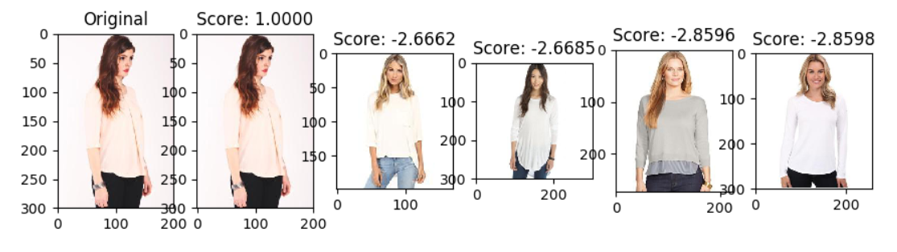

# deep-fashion-retrieval
Simple image retrieval algorithm on [deep-fashion dataset](http://mmlab.ie.cuhk.edu.hk/projects/DeepFashion/AttributePrediction.html) with pytorch

### Dependencies
- Python (Compatible with 2 and 3)
- [Pytorch](http://pytorch.org/)
- Torchvision
- PIL
- cv2(only for visualizing)

[Anaconda](https://www.anaconda.com/download/) is recommended.

### Training
1. Download dataset from [DeepFashion: Attribute Prediction](http://mmlab.ie.cuhk.edu.hk/projects/DeepFashion/AttributePrediction.html)
2. Unzip all files and set `DATASET_BASE` in `config.py`
3. Run `train.py`

The models will be saved to `DATASET_BASE/models`.

Deep Feature: ResNet50 - (Linear 1024 to 512) - (Linear 512 to 20), the 512-dim vector is regarded as images' identical features.

Loss: CrossEntropyLoss + TripletMarginLoss * Weight

Color Feature: Get ResNet50 final conv layer output(N * C * 7 * 7), then do avg_pooling on channel dim. Choose the max-N responses and extract the corresponding blocks on avg_pooling map of original image.

Training details: Freeze the conv parameters and train net until a stable accuracy and loss, then set FREEZE to False and train it again.

If you applied the [DeepFashion: In-shop Clothes Retrieval](http://mmlab.ie.cuhk.edu.hk/projects/DeepFashion/InShopRetrieval.html), you can set `ENABLE_INSHOP_DATASET` to `True`.

Directory structure:
- DATASET_BASE
    - Anno
    - Eval
    - img
    - models(generated)
    - in_shop(optional)
        - list_bbox_inshop.txt
        - list_eval_partition.txt
        - img
    - all_feat.list(generated)
    - all_feat.npy(generated)
    - all_color_feat.npy(generated)
    

### Generating feature databases
- Feature extraction
    - Set `DUMPED_MODEL` in `config.py` as trained model
    - Run `feature_extractor.py`
    
    The feature will be saved to `DATASET_BASE/all_feat.npy`, `DATASET_BASE/all_color_feat.npy` and `DATASET_BASE/all_feat.list`.
- Accelerating querying by clustering
    - Run `kmeans.py` to train the models, default 50 clusters.
    
        The model will be saved as `DATABASE/models/kmeans.m` 

### Query with a picture

- Run `retrieval.py img_path`, for example:

    `python retrieval.py img/Sheer_Pleated-Front_Blouse/img_00000005.jpg`.
    
    Set `DISTANCE_METRIC` in `config.py` to use different [metrics](https://docs.scipy.org/doc/scipy/reference/generated/scipy.spatial.distance.cdist.html) such as `cosine`, `euclidean` on deep feature and color feature..
    
### Time cost
- 2.854 sec for loading model
- 0.078 sec for loading feature database
- 0.519 sec for extracting feature of given image
- 0.122 sec for doing naive query(139,709 features)
- 0.038 sec for doing query with kmeans(139,709 features)

### Environment
- Intel(R) Core(TM) i7-4790K CPU @ 4.00GHz with 32GB RAM
- GeForce GTX TITAN X with CUDA 7.5
- Ubuntu 14.04
- Pytorch 0.2.0_4

### Future works
- Add web support
- Add more models and fuse them
